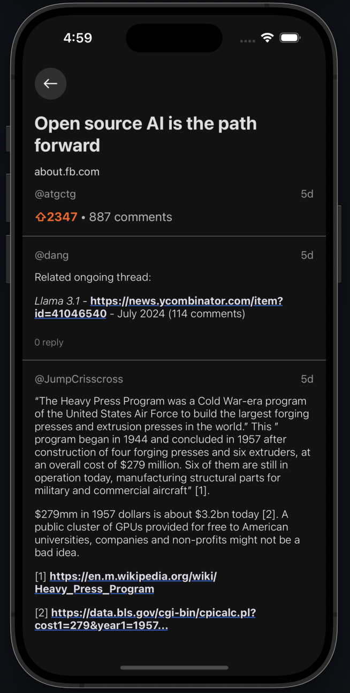
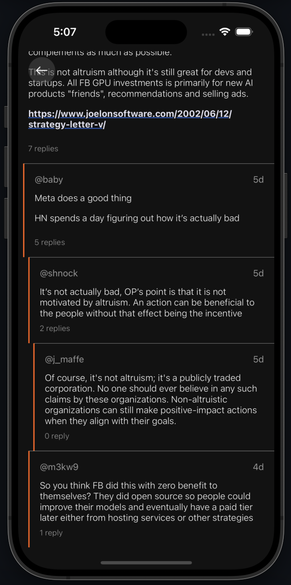
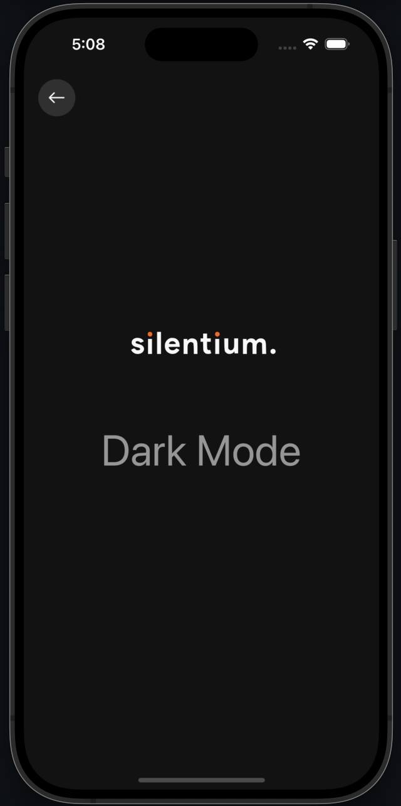

# Silentium Test

##### Home

 

##### Details

  

##### Setting



## 🌱 Prerequisites

Before running the project, ensure that you have the following installed:

- Node.js (version >= 18)
- React Native CLI
- Android SDK (for Android development)
- Xcode (for iOS development)

## ⚙️ Installation

1. Clone the repository:

```
git clone https://github.com/kazhoang/silentiumTest.git
```

2. Navigate to the project directory:

```
cd silentiumTest
```

3. Install the project dependencies:

```
yarn
```

***

- For iOS, Install the CocoaPods dependencies:

```
yarn pod
```

## Running the Application

### Android

```
yarn android
```

### IOS

```
yarn ios
```

## Project Structure

The project follows a standard React Native structure:

```bash
├── .env
├── android
├── ios
└── src
    ├── components
    ├── navigators
    ├── screens
    ├── services
    ├── theme
    ├── types
    ├── utils
    └── App.tsx
```

## 📚 Dependencies

The project utilizes the following key dependencies:

| Library                             | Category         | Version | Description                                                                      |
| ----------------------------------- | ---------------- | ------- | -------------------------------------------------------------------------------- |
| React Native                        | Mobile Framework | v0.74   | The best cross-platform mobile framework                                         |
| React                               | UI Framework     | v18     | The most popular UI framework in the world                                       |
| TypeScript                          | Language         | v5      | Static typechecking                                                              |
| React Navigation                    | Navigation       | v6      | Performant and consistent navigation framework                                   |
| React Native Reanimated             | UI               | v3      | Animations library for React Native                                              |
| React Native MMKV                   | Storage          | v2      | Key-value storage library for persisting application state                       |

For a complete list of dependencies, refer to the `package.json` file.

## 🏗️ Development

To run unit test, run:

```
yarn test
```

You can able to clean up the project with the following command

```
yarn clean
```
